# machine-learning


## 1. ML Theory:

## 2. ML with Python

## 9. Installing Keras with TensorFlow backend and scikit-learn using Python virtual environment:


## 1. ML Theory:

## Installation:

### What is Machine Learning

**What is Machine Learning:**

Find patterns in data. Use those patterns to predict the future.

**What does it mean to Learn:**

**Machine Learning in a Nutshell:**

1. You find data that contains patterns
2. Feed that data into machine learning algorithms to find patterns in the data
3. That algorithm generate something as known - Model. A model - functionality that can recognize patterns with new data.
4. Application - supplies new data to model to see if it matches known patterns. 

Please see the example 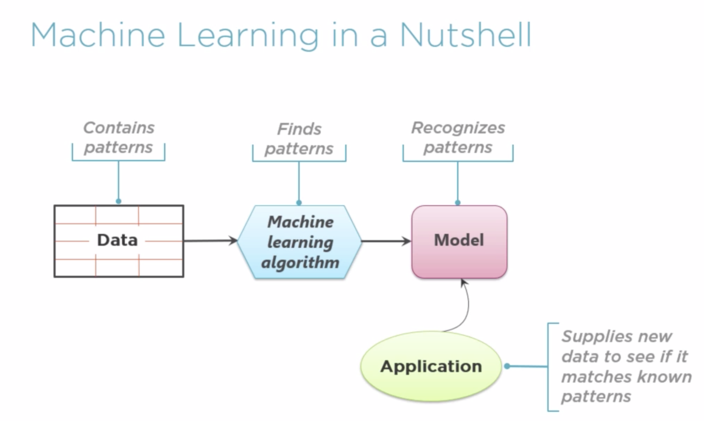

**What is a data scientist:**

Someone who knows about:

- Statistics

- Machine learning software

- Some problem domain(ideally)

### The Machine Learning Process is:

The First Problem: **Asking the Right Question**

- Ask yourself: Do you have the right data to answer this question?

- Do you know how you'll measure success?

- Model: how good those predictions must be to make this process qualify to make it success?


The Machine Learning process:

1. To start you choose that data(what data is more likely to be predictive)

2. Prepared data to be ready for processing, basically apply pre-processing to data (clean, organize, format, get it prepared)

3. Applying learning algorithms to that prepared data.

4. Create candidate Model -  iterate to find the best model

5. Deploy chosen model

Please see the example 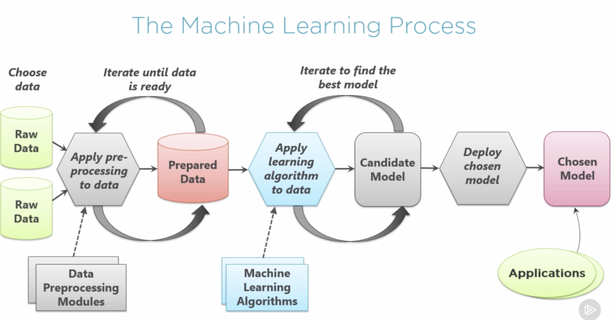


The next step is repeating the Machine Learning process regulary:


Please see the example 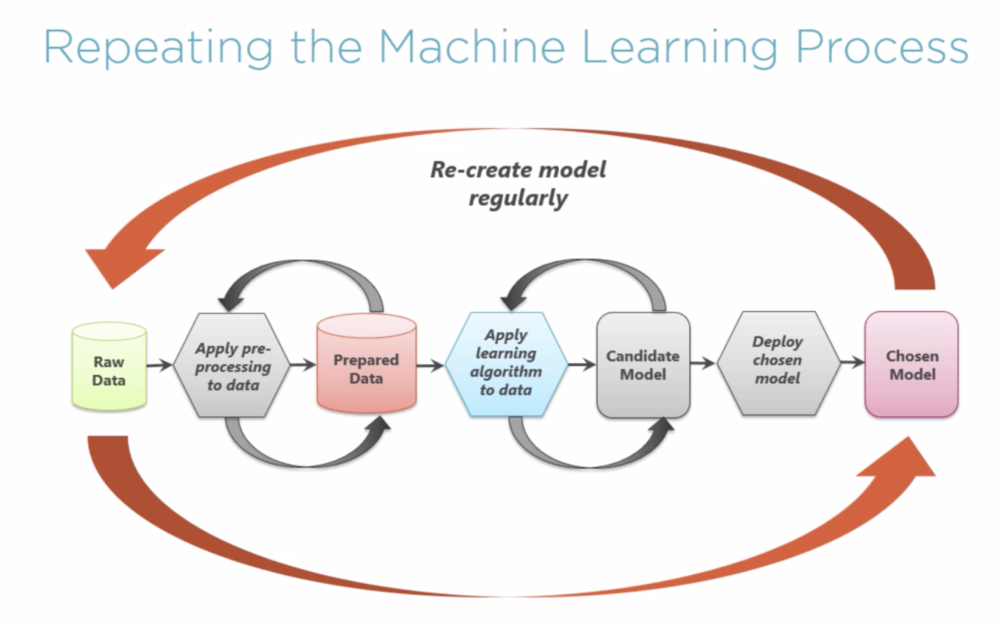


### Machine-Learning Concepts:

**Terminology:**

*Training data* - prepared data to use to create Model

*Supervised learning* - the value you want to predict is in the training data. The data is labeled.

*Unsupervised learning* - the value you want to predict is not in the training data. The data is unlabeled.


### Data Pre-processing with Supervised Learning:

Training-data, please see the example 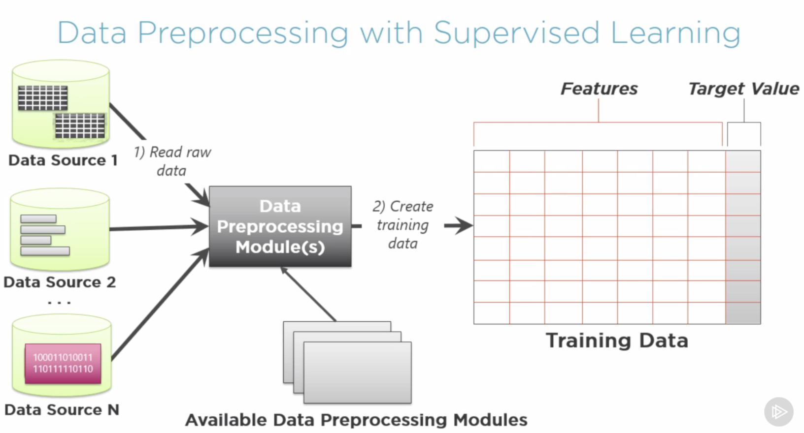


**Categorizing Machine Learning Problems: Regression**

please see the example 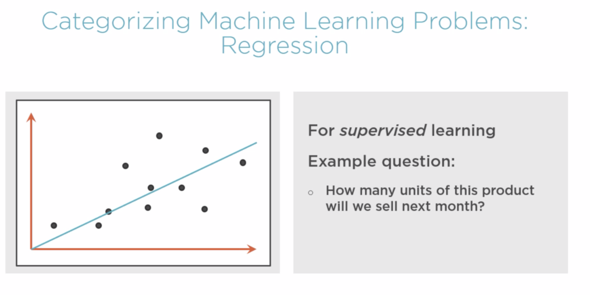


**Categorizing Machine Learning Problems: Classification**

please see the example 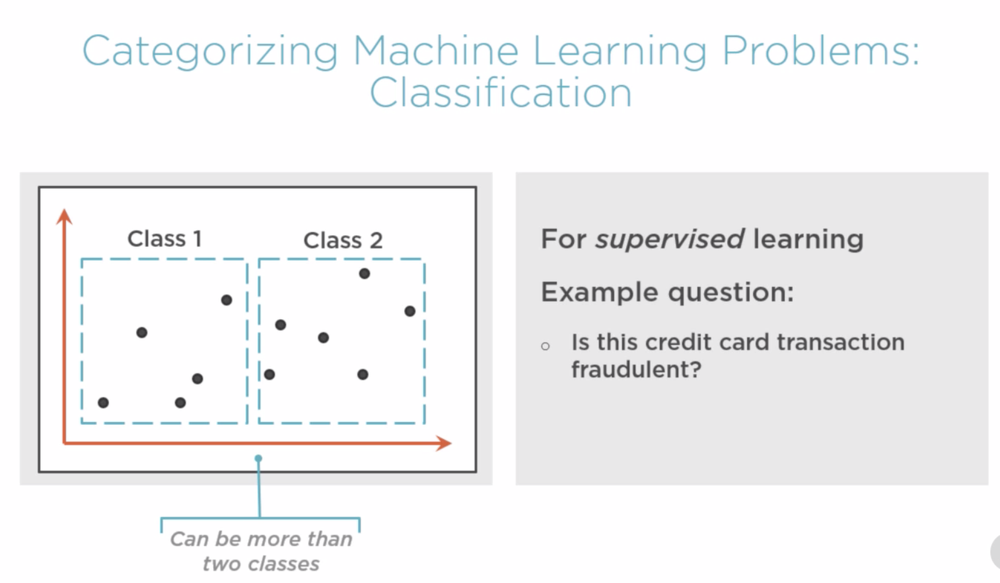


**Categorizing Machine Learning Problems: Clustering**

please see the example 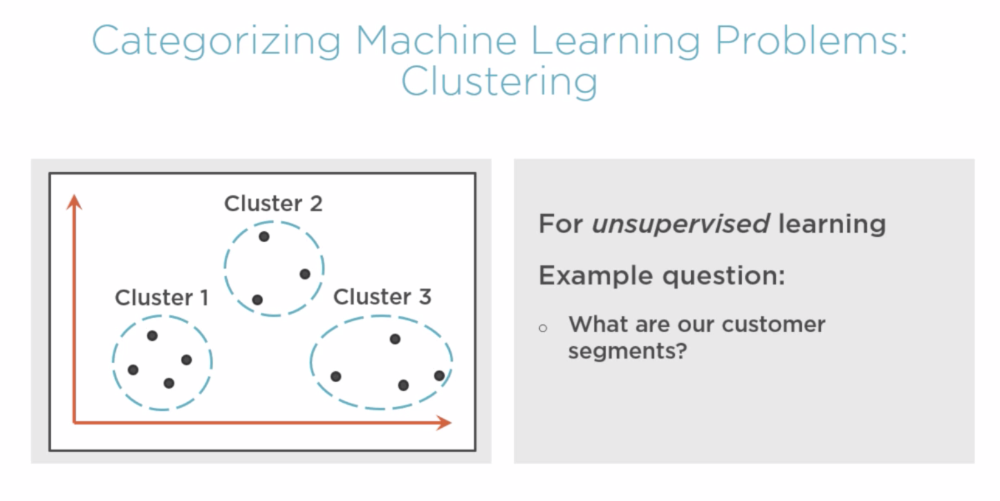


**Styles of Machine Learning Algorithms:**

please see the example 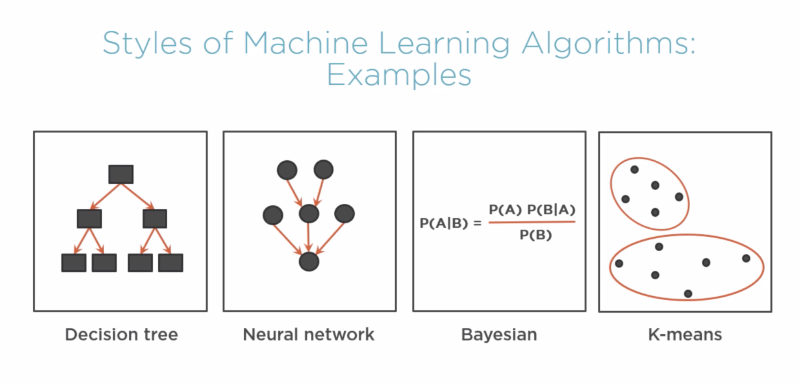

**Training a Model with Supervised Learning: Choose Features**

please see the example 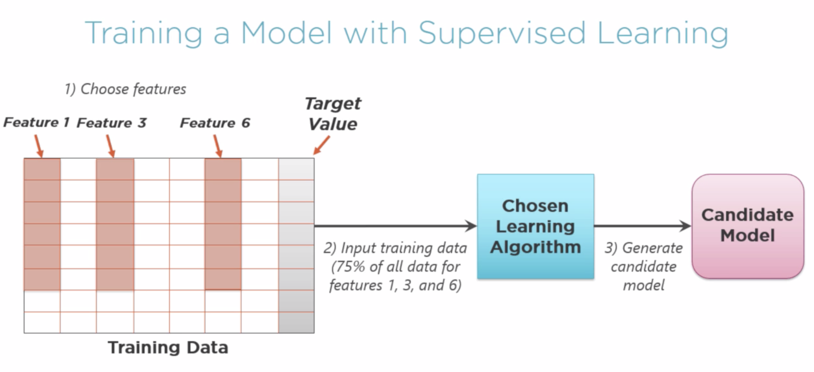


**Testing a Model with Supervised Learning: Test the results and compare target values generated from test data  with actual target values**

please see the example 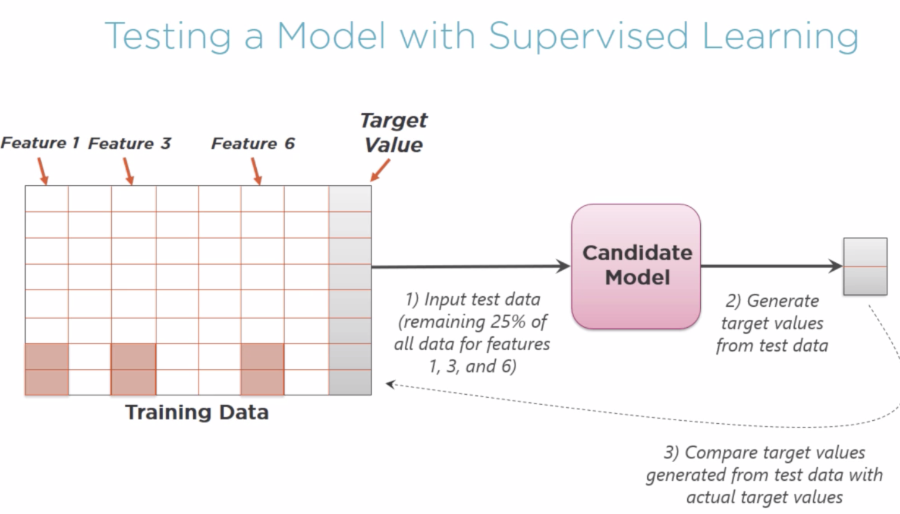


**Improve a Model with Supervised Learning: Some Options**

please see the example 


**Using a Model:**

please see the example 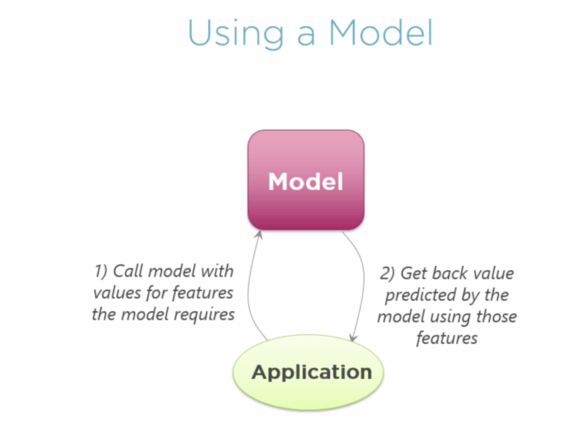


## 2. ML with Python

**Machine Learning Logic**

1. Data - get data and modify into format that ML can use

2. Algorithm - pass these data into algorithm

3. Data Analysis - analyses these data and create a model

4. Model - solution to solve the problem based on input data

**Machine Learning Technique Comparison:**

please see the example 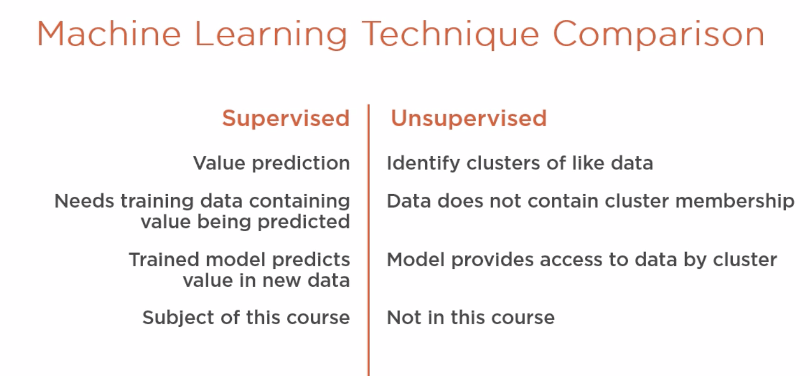


### Machine Learning Workflow:

MLW - an orchestrated and repeatable pattern which systematically transforms and processes information to create prediction solutions.


1. Asking the right question(goals we want to achieve, data we need and process we want to perform)

2. Preparing data (gather the data we need to answer our questions)

3. Selecting the algorithm (consider which algorithm we use)

4. Training the model

5. Testing the model (test accuracy, generate statistics)


#### Asking the right question:


Example: "Predict if a person will develop diabetes"

Need statement to direct and validate work:

 - Define scope(including data source):
  
Predict if a person will be develop diabetes;

Identify critical features;

Focus on at risk population

Select data source

Pima Indian Diabetes study is a good source

Summary: Using Pima Indian Diabetes data, predict which people will develop diabetes


 - Define target performance(what prediction accuracy we should expect)
 

We will define diabetes in Binary fashion: diabetes or not diabetes

Binary result (True or False)

Genetic difference are a factor

70% Accuracy is common target

Summary:  Using Pima Indian Diabetes data, predict with 70% or great accuracy. which people will develop diabetes


 - Define context of usage
 
 
 What does it mean disease prediction
 
 Medical research practices
 
 Unknown variations between people
 
 Likelihood is used
 
 Summary:  Using Pima Indian Diabetes data, predict with 70%, which people are likely to develop diabetes

 
 - Define how solution will be created
 
 Machine Learning Workflow:
 
 Process Pima Indian data
 
 Transform data as required
 
 Summary:  Use the Machine Learning Workflow to process and transform Pima Indian data to create a prediction model. 
 This Model must predict with people are likely to develop diabetes with  70% or greater accuracy.
 
 
 
#### 2. Preparing Data

80% of work are getting, cleaning and organize the data

Data Rule #1: closer the data is to what you are predicting, the better

Data Rule #2: Data will never be in the format you need

Please see the following link with Notebook example: https://github.com/constantine77/machine-learning/blob/master/notebooks/pima-prediction-diabetes.ipynb

#### 3. Selecting the Algorithm

How to decide which algorithm to use?

Algorithm Selection:

1. Learning Type (what learning type they support)

2. Result (result type the algorithm predicts)

3. Complexity (the complexity of the algorithm)

4. Basic vs enhanced


1. Learning Type - we are looking into solution statement and guidance it offered.
We see the prediction keyword - prediction means supervised machine learning.

2. Result Type - prediction can be divided into two subcategories: Regression and Classification.

Regression means: continuous set of values

Classification means: discrete values, small, medium, large or true and false. 

3. Complexity: keep it simple and eliminate "ensemble" algorithms.
 
4. Basic vs enhanced: we choose basic algorithm

Candidate Algorithms:

Naive Bayes

Logistic Regression

Decision Tree


## Neural networks Part 1 - Anomaly Detection with Autoencoder


What is a Neural Network?

A **Neural Network** is a series of algorithms that endeavors to recognize underlying relationships in a set of data through a process that mimics the way the human brain operates. Neural networks can adapt to changing input; so the network generates the best possible result without needing to redesign the output criteria. 

A neural network works similarly to the human brain’s neural network. A “neuron” in a neural network is a mathematical function that collects and classifies information according to a specific architecture. 

Neural networks are computing systems with interconnected nodes that work much like neurons in the human brain. Using algorithms, they can recognize hidden patterns and correlations in raw data, cluster and classify it, and – over time – continuously learn and improve.

How neural networks work?

A simple neural network includes an input layer, an output (or target) layer and, in between, a hidden layer. The layers are connected via nodes, and these connections form a “network” – the neural network – of interconnected nodes.

please see the diagram 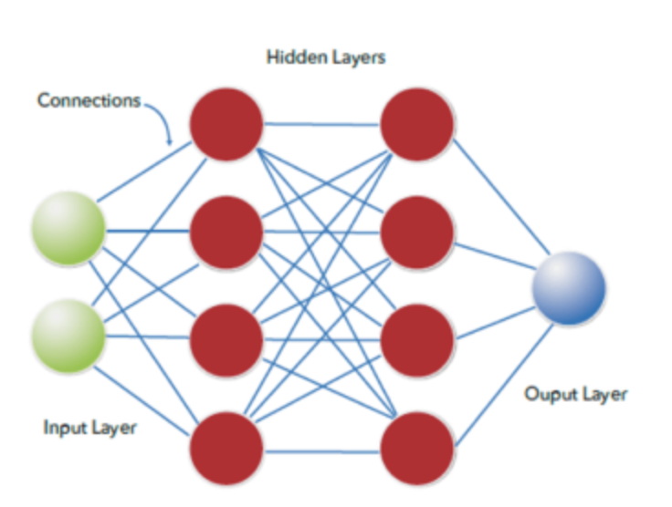


What is the difference between Neural Networks and Deep Learning?

There is no difference. Deep Learning describes the training of artificial neural networks with more than one hidden layer.
Deep learning is a machine learning technique that performs learning in more than two hidden layers.
You can also put it in this way – deep learning is an advanced version of the neural network.

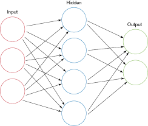

and


Neural Network Types:

Supervised vs Unsupervised Learning:

Neural networks learn via supervised learning; Supervised machine learning involves an input variable x and output variable y. The algorithm learns from a training dataset. With each correct answers, algorithms iteratively make predictions on the data. The learning stops when the algorithm reaches an acceptable level of performance.

Unsupervised machine learning has input data X and no corresponding output variables. The goal is to model the underlying structure of the data for understanding more about the data. The keywords for supervised machine learning are classification and regression. For unsupervised machine learning, the keywords are clustering and association.


Algorithms of neural networks:

**Autoencoder** neural networks are used to create abstractions called encoders, created from a given set of inputs. Although similar to more traditional neural networks, autoencoders seek to model the inputs themselves, and therefore the method is considered unsupervised. The premise of autoencoders is to desensitize the irrelevant and sensitize the relevant. As layers are added, further abstractions are formulated at higher layers (layers closest to the point at which a decoder layer is introduced). These abstractions can then be used by linear or nonlinear classifiers.

Autoencoder is an unsupervised Neural Network. It is a data compression algorithm which takes the input and going through a compressed representation and gives the reconstructed output.


Why choose Autoencoder:

As I mentioned above, I want to treat this problem as unsupervised task, particularly as outlier (anomaly) detection task. There are different anomaly detection models (algorithms), but I chose Autoencoders for two reasons. First, thier simplicity to use them, and the second reason is due to the complexity of the data in hand. Plus, the last couple of years, they are getting popularity in real world problems such as in fraud detections.


Links:

https://blog.goodaudience.com/neural-networks-for-anomaly-outliers-detection-a454e3fdaae8


**Keras** is one of the leading high-level neural networks APIs. It is written in Python and supports multiple back-end neural network computation engines.

Keras was created to be user friendly, modular, easy to extend, and to work with Python. The API was “designed for human beings, not machines,” and “follows best practices for reducing cognitive load.”

Neural layers, cost functions, optimizers, initialization schemes, activation functions, and regularization schemes are all standalone modules that you can combine to create new models. New modules are simple to add, as new classes and functions. Models are defined in Python code, not separate model configuration files.

Keras proper does not do its own low-level operations, such as tensor products and convolutions; it relies on a back-end engine for that. Even though Keras supports multiple back-end engines, its primary (and default) back end is TensorFlow, and its primary supporter is Google. The Keras API comes packaged in TensorFlow as tf.keras, which as mentioned earlier will become the primary TensorFlow API as of TensorFlow 2.0.

**TensorFlow** created by the Google Brain team, TensorFlow is an open source library for numerical computation and large-scale machine learning. TensorFlow bundles together a slew of machine learning and deep learning (aka neural networking) models and algorithms and makes them useful by way of a common metaphor. It uses Python to provide a convenient front-end API for building applications with the framework, while executing those applications in high-performance C++.

Currently, the most famous deep learning library in the world is Google's TensorFlow. Google product uses machine learning in all of its products to improve the search engine, translation, image captioning or recommendations.


### Artificial Neuron:

Neural Networks are the building blocks for making Intelligent Systems.


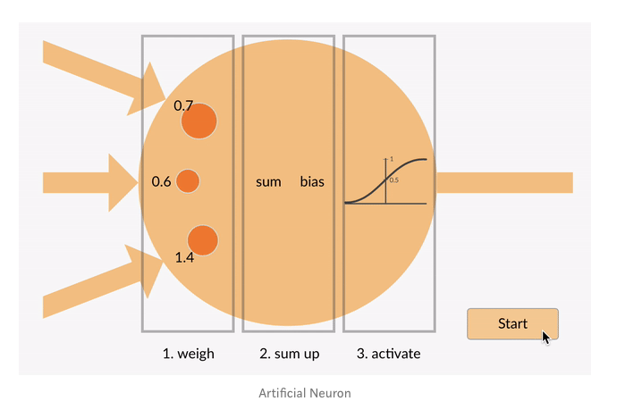

So this what the architecture of Artificial Neuron looks like:

The 3 arrows correspond to the 3 inputs coming into the network.
The values [0.7,0.6,1.4] are the weights assigned to the corresponding input.
So what are weights now?
Let’s take an example to understand this term.
Consider a university which grants student admission on 2 basis .One is their grades and second is the university test .
So this university has decided that grades will carry 70% of the overall weightage and university test will carry 30% for the admission process.

Coming back to our network.

Inputs get multiplied with their respective weights and their sum is taken.
Consider 3 inputs as x1,x2,x3.
Consider 3 weights be w1,w2,w3
Sum = x1w1 + x2w2+x3w3.
i.e. Sum=x1(0.7) + x2(0.6) + x3(1.4)

After summing we add bias to the sum obtained.
This Bias is just a constant number say 1 which is added for scaling purposes.
NewSum=x1(0.7) + x2(0.6) + x3(1.4) + bias
It’s not necessary to add bias but it is a good practice as it speeds up the process.

After adding bias, we reach at threshold step. If the newsum calculated is above the threshold value the neuron gets excited and it passes out the output.


### Understanding Activation Functions in Neural Networks:
So what does an artificial neuron do? Simply put, it calculates a “weighted sum” of its input, adds a bias and then decides whether it should be “fired” or not ( yeah right, an activation function does this, but let’s go with the flow for a moment ).

So consider a neuron.

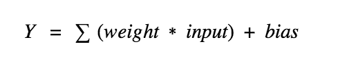

Now, the value of Y can be anything ranging from -inf to +inf. The neuron really doesn’t know the bounds of the value. So how do we decide whether the neuron should fire or not ( why this firing pattern? Because we learnt it from biology that’s the way brain works and brain is a working testimony of an awesome and intelligent system ).

We decided to add “activation functions” for this purpose. To check the Y value produced by a neuron and decide whether outside connections should consider this neuron as “fired” or not. Or rather let’s say — “activated” or not.


Now, which activation functions to use. Does that mean we just use ReLu for everything we do? Or sigmoid or tanh? Well, yes and no. For example, a sigmoid works well for a classifier.
If you don’t know the nature of the function you are trying to learn, then maybe i would suggest start with ReLu, and then work backwards. ReLu works most of the time as a general approximator!


### Autoencoder Architecture

An autoencoder is a feed-forward multilayer neural network that reproduces the input data on the output layer. By definition then, the number of output units must be the same as the number of input units. The autoencoder is usually trained using the backpropagation algorithm against a loss function, like the mean squared error (MSE).


For this case study, we built an autoencoder with three hidden layers, with the number of units 30-14-7-7-30 and tanh and reLu as activation functions, as first introduced in the blog post “Credit Card Fraud Detection using Autoencoders in Keras — TensorFlow for Hackers (Part VII),” by Venelin Valkov


The autoencoder was then trained with Adam — an optimized version of backpropagation — on just legitimate transactions, for 50 epochs, against the MSE as a loss function.

### Data Preparation

There is not much to do for data preparation in this use case, just a few steps


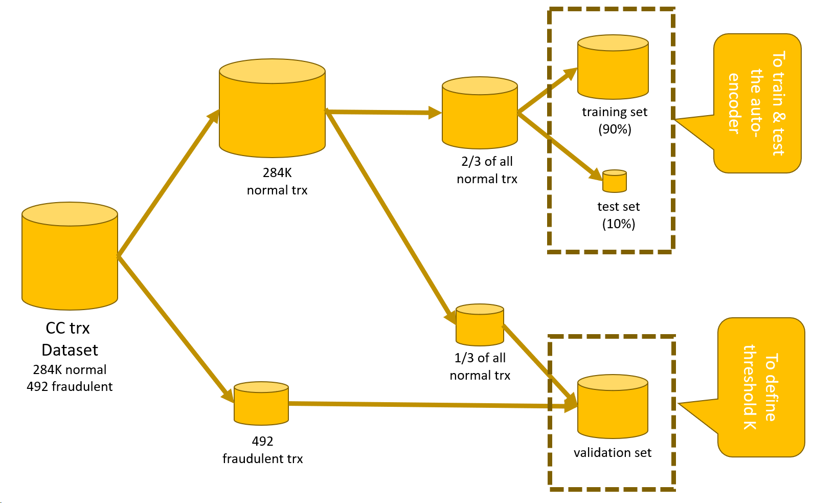


Split the original data set into a number of subsets (Figure 2). Define:
a training set, consisting of only “normal” transactions, to train the autoencoder
a test set, again of only “normal” transactions, to test the autoencoder
a validation set with mixed “normal” and “fraudulent” transactions to define the value of threshold K
Neural networks accept only normalized input vectors falling in [0,1]. We will need to normalize all input features to fall in [0,1].

### Training and Testing the Autoencoder

One input layer with as many dimensions (30) as the input features (Keras Input Layer node)
A hidden layer that compresses the data into 14 dimensions using tanh activation function (Keras Dense Layer node)
A hidden layer that compresses the data into 7 dimensions using reLU activation function (Keras Dense Layer node)
One more hidden layer that transforms the input 7 dimensions into 7 other dimensions using tanh activation function (Keras Dense Layer node)
One output layer that expands the data back to as many dimensions as in the input vector (30) using reLU activation function (Keras Dense Layer node)
This autoencoder is trained using the Keras Network Learner node, where the number of epochs and the batch size are set to 50, the training algorithm is set to Adam, and the loss function is set to be the mean squared error


After training, the network is applied on the data from the test set to reproduce the input features using the DL Network Executor node, and it is saved for deployment as a Keras file using the Keras Network Writer node.

The next step would be to calculate the distance between the original feature vector and the reproduced feature vector and to define the optimal threshold K to discover fraud candidates.


### Rule for Fraud Candidates

When the model training is finished, the autoencoder knows how to reproduce feature vectors representing legitimate transactions onto the output layer. How can we now spot suspicious transactions? If we have a new transaction xk, how can we tell whether it is a suspicious one or a legitimate one?
First, we run this new transaction X through the autoencoder. The reproduction of the original transaction is generated at the output layer.
Now a reconstruction error & is calculated as the distance between the original transaction vector and the reproduced one.
A transaction is then considered a fraud candidate according to the following rule:
XK → "normal" if Ek <K
XK → "anomaly" if Ek > K where Ek is the reconstruction error value for transaction xk and K is a threshold. The Mean Square distance was also adopted for the reconstruction error.
The value of threshold Kis defined on a validation set. If a validation set with labeled fraudulent transactions is available, the value of threshold Kis optimized against the accuracy of fraud detection. Otherwise, if no labeled fraudulent transactions are available, the value of threshold Kis defined as a high percentile of the reconstruction errors on the validation set.


###vOptimizing Threshold K

The value of the loss function at the end of the autoencoder training though does not tell the whole story. It just tells how well the network is able to reproduce “normal” input data onto the output layer. To have a full picture of how well this approach performs in detecting anomalies, we need to apply the anomaly detection rule to the validation set. We will use the prediction accuracy on the validation set to optimize the value of threshold K.


## Neural networks Part 2 - Anomaly Prediction with LSTM


## Evaluating production readiness

Data:

- Feature expectations are captured in a schema.
- All features are beneficial.
- No feature’s cost is too much.
- Features adhere to meta-level requirements.
- The data pipeline has appropriate privacy controls.
- New features can be added quickly.
- All input feature code is tested.

Model:

- Model specs are reviewed and submitted.
- Offline and online metrics correlate.
- All hyperparameters have been tuned.
- The impact of model staleness is known.
- A simple model is not better.
- Model quality is sufficient on important data slices.
- The model is tested for considerations of inclusion.

Infrastructure:

- Training is reproducible.
- Model specs are unit tested.
- The ML pipeline is integration tested.
- Model quality is validated before serving.
- The model is debuggable.
- Models are canaried before serving.
- Serving models can be rolled back.

Monitoring:

- Dependency changes result in notification.
- Data invariants hold for inputs.
- Training and serving are not skewed.
- Models are not too stale.
- Models are numerically stable.
- Computing performance has not regressed.
- Prediction quality has not regressed.

## Installing Keras with TensorFlow backend and scikit-learn using Python virtual environment:


1. Update pip:

```
pip3 install --upgrade pip
```

2. Create keras_tf virtual environment:

```
python3 -m venv keras_tf
```

3. Activate keras_tf virtual environment:

```
source keras_tf/bin/activate
```

4. Installing a few Python dependecies:


install Jupyter:

```
python3 -m pip install jupyter
```

install Tensorflow:

```
pip3 install --upgrade tensorflow
```


install Keras:

```
pip3 install keras
```

numpy - scientific computing:

```
pip3 install numpy
```

pandas - data frame:

```
pip3 install pandas
```

matplotlib - 2d ploting:

```
pip3 install matplotlib
```

scikit-learn - ML algorithms, pre-processing, preformance evaluation, etc:

```
pip3 install scikit-learn
```


5. **Jupyter Notebook**

command to lunch:

```
jupyter notebook
```

Tips:

shift + tab - you can see command description


## Links:


1. Autoencoder:

activation function:

https://medium.com/the-theory-of-everything/understanding-activation-functions-in-neural-networks-9491262884e0

https://becominghuman.ai/what-is-an-artificial-neuron-8b2e421ce42e

Simple Autoencoders using Keras:

https://medium.com/datadriveninvestor/simple-autoencoders-using-keras-6e67677f5679

1. Understanding Machine Learning:
https://app.pluralsight.com/player?course=understanding-machine-learning&author=david-chappell&name=understanding-machine-learning-m4&clip=6&mode=live

2: Understanding ML with Python:


3. Project Management:

https://www.jeremyjordan.me/ml-projects-guide/

https://towardsdatascience.com/complete-guide-to-machine-learning-project-structuring-for-managers-2412bd57a5d
