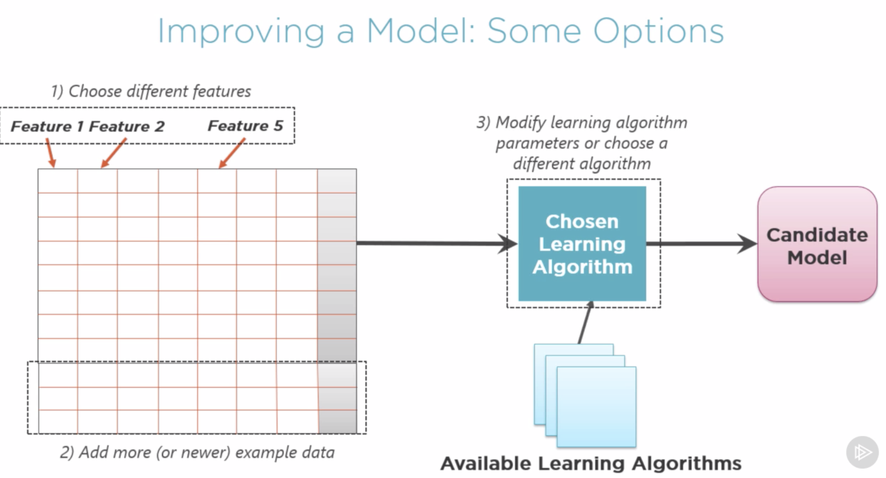

# machine-learning


## 1. ML Theory:

## 2. ML with Python


## 1. ML Theory:

### What is Machine Learning

**What is Machine Learning:**

Find patterns in data. Use those patterns to predict the future.

**What does it mean to Learn:**

**Machine Learning in a Nutshell:**

1. You find data that contains patterns
2. Feed that data into machine learning algorithms to find patterns in the data
3. That algorithm generate something as known - Model. A model - functionality that can recognize patterns with new data.
4. Application - supplies new data to model to see if it matches known patterns. 

Please see the example 

**What is a data scientist:**

Someone who knows about:

- Statistics

- Machine learning software

- Some problem domain(ideally)

### The Machine Learning Process is:

The First Problem: **Asking the Right Question**

- Ask yourself: Do you have the right data to answer this question?

- Do you know how you'll measure success?

- Model: how good those predictions must be to make this process qualify to make it success?


The Machine Learning process:

1. To start you choose that data(what data is more likely to be predictive)

2. Prepared data to be ready for processing, basically apply pre-processing to data (clean, organize, format, get it prepared)

3. Applying learning algorithms to that prepared data.

4. Create candidate Model -  iterate to find the best model

5. Deploy chosen model

Please see the example 


The next step is repeating the Machine Learning process regulary:


Please see the example 


### Machine-Learning Concepts:

**Terminology:**

*Training data* - prepared data to use to create Model

*Supervised learning* - the value you want to predict is in the training data. The data is labeled.

*Unsupervised learning* - the value you want to predict is not in the training data. The data is unlabeled.


### Data Pre-processing with Supervised Learning:

Training-data, please see the example 


**Categorizing Machine Learning Problems: Regression**

please see the example 


**Categorizing Machine Learning Problems: Classification**

please see the example 


**Categorizing Machine Learning Problems: Clustering**

please see the example 


**Styles of Machine Learning Algorithms:**

please see the example 

**Training a Model with Supervised Learning: Choose Features**

please see the example 


**Testing a Model with Supervised Learning: Test the results and compare target values generated from test data  with actual target values**

please see the example 


**Improve a Model with Supervised Learning: Some Options**

please see the example 


**Using a Model:**

please see the example 


## 2. ML with Python

**Machine Learning Logic**

1. Data - get data and modify into format that ML can use

2. Algorithm - pass these data into algorithm

3. Data Analysis - analyses these data and create a model

4. Model - solution to solve the problem based on input data

**Machine Learning Technique Comparison:**

please see the example 


## Installation:

**Python:**

numpy - scientific computing

```buildoutcfg
pip install numpy
```


pandas - data frames

```buildoutcfg
pip3 install pandas
```

matplotlib - 2d plotting

```buildoutcfg
pip3 install matplotlib
```

scikit-learn - ML algorithms, pre-processing, performance evaluation, etc...

```buildoutcfg
python3 -m pip install scikit-learn
```

**Jupyter Notebook**

command to lunch:

```
jupyter notebook
```


## Links:

1. Understanding Machine Learning:
https://app.pluralsight.com/player?course=understanding-machine-learning&author=david-chappell&name=understanding-machine-learning-m4&clip=6&mode=live

2: Understanding ML with Python:

